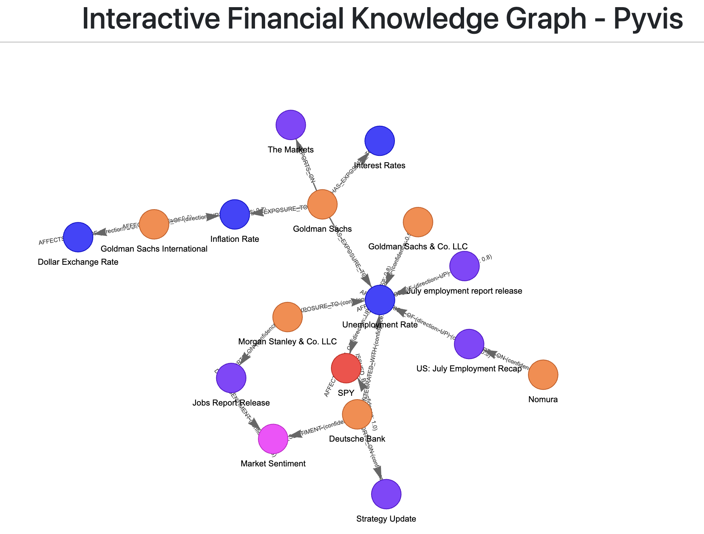

# Financial Knowledge Graph Builder

A purpose-built system for extracting financial knowledge graphs from unstructured documents using local LLMs and a specialized financial ontology. Designed specifically for price prediction by focusing on entities and relationships that actually drive market prices.

## Features

- **Purpose-built Financial Ontology**: Uses `schema.py` with entities and relations specifically designed for price prediction
- **Dual Visualization Support**: Both Pyvis and Plotly interactive HTML graphs with hover details
- **Local LLM Support**: Works with Ollama models (llama3.2, etc.)
- **Automatic Backup**: Preserves previous results with timestamp-based backups
- **SQLite Storage**: Raw data accessible via SQL queries
- **Multi-format Support**: PDF, TXT, MD files with file-type detection
- **LangGraph Pipeline**: Uses LangGraph for robust document processing workflows

## Quick Start

### 1. Setup

```bash
python3 -m venv .venv
source .venv/bin/activate
python -m pip install -r requirements.txt
```

### 2. Configure Environment

Create `.env` file:
```bash
# Ollama model (default: llama3.2)
OLLAMA_MODEL=llama3.2
```

### 3. Add Source Files

Place your financial documents in the `source/` directory. The system automatically detects file types:

```bash
source/
├── report_[DB]US Fixed Income Weekly.pdf
├── report_GS_US Daily Q&A on the Revisions in the July Employment Report.pdf
├── report_MS_US Economics_ large downward revision to nfp.pdf
├── report_US_July Employment Recap.pdf
├── transcript_GS250724.pdf
└── transcript_GS250731.pdf
```

### 4. Run Pipeline

```bash
# Start Ollama server
ollama serve  

# Run the knowledge graph builder
python langgraph_local_kg.py
```

## Output Files

- **`kg_local.sqlite`**: Raw graph data (nodes and edges tables)
- **`kg_local_pyvis.html`**: Interactive Pyvis visualization
- **`kg_local_plotly.html`**: Interactive Plotly visualization (if Plotly installed)
- **`backup/`**: Timestamped backups of previous runs

## Viewing Results

### Interactive Visualizations

**Pyvis Visualization** (`kg_local_pyvis.html`):
- **Hover details**: Click on nodes/edges for full information
- **Drag to explore**: Move nodes around
- **Zoom and pan**: Navigate large graphs
- **Physics simulation**: Automatic layout with physics

**Plotly Visualization** (`kg_local_plotly.html`):
- **Advanced interactions**: Hover, zoom, pan, select
- **Color-coded entities**: Different colors for each entity type
- **Professional styling**: Publication-ready graphs

### Raw Data Queries

```bash
# View all nodes
sqlite3 kg_local.sqlite '.headers on' '.mode column' 'SELECT * FROM nodes;'

# View all edges  
sqlite3 kg_local.sqlite '.headers on' '.mode column' 'SELECT * FROM edges;'

# Find specific relationships
sqlite3 kg_local.sqlite '.headers on' '.mode column' 'SELECT * FROM edges WHERE rel="AFFECTS_PRICE_OF";'

# Count by entity type
sqlite3 kg_local.sqlite 'SELECT type, COUNT(*) FROM nodes GROUP BY type;'

# Find high-confidence relationships
sqlite3 kg_local.sqlite 'SELECT * FROM edges WHERE confidence > 0.8 ORDER BY confidence DESC;'
```

### Python Data Access

```python
import sqlite3
import pandas as pd
import networkx as nx

# Load data into pandas
con = sqlite3.connect('kg_local.sqlite')
nodes_df = pd.read_sql_query("SELECT * FROM nodes", con)
edges_df = pd.read_sql_query("SELECT * FROM edges", con)
con.close()

# Analyze the graph
print(f"Total entities: {len(nodes_df)}")
print(f"Total relationships: {len(edges_df)}")
print("\nEntity types:")
print(nodes_df['type'].value_counts())

# Create NetworkX graph for analysis
G = nx.DiGraph()
for _, row in nodes_df.iterrows():
    G.add_node(row['id'], **row.to_dict())
for _, row in edges_df.iterrows():
    G.add_edge(row['source'], row['target'], **row.to_dict())

# Find most connected entities
centrality = nx.degree_centrality(G)
top_nodes = sorted(centrality.items(), key=lambda x: x[1], reverse=True)[:5]
print("Most connected entities:", top_nodes)
```

## Financial Ontology

The system uses a purpose-built ontology (`schema.py`) with entities specifically designed for price prediction:

### Entity Types
- **Instrument**: Tradable assets (equity, commodity, FX, index, ETF, future, option)
- **Company**: Issuer or operating entity
- **EconomicIndicator**: Macro time series (GDP, inflation, employment)
- **IndicatorPrint**: Specific release/print of an indicator with actual vs consensus
- **Event**: Discrete drivers (geopolitical, earnings, policy, natural disasters)
- **PolicyAction**: Central bank or regulator decisions
- **Sentiment**: Market mood indicators with confidence scores
- **CommodityFundamental**: Supply/demand metrics for commodities
- **FXMacro**: Macro state relevant to FX pairs
- **AnalystForecast**: Forward estimates for earnings/growth/inflation
- **Source**: Document provenance and metadata

### Relationship Types
- **AFFECTS_PRICE_OF**: Causal price impact with direction, confidence, and temporal properties
- **SURPRISE_OF**: IndicatorPrint surprise attached to Indicator
- **DRIVES_SENTIMENT**: Events/indicators influencing market mood
- **HAS_EXPOSURE_TO**: Company/instrument exposure to commodities/countries
- **HEDGED_BY**: Instrument hedged by another
- **COINTEGRATED_WITH**: Statistical long-run linkages
- **LEADS**: Lead-lag relationships between entities
- **SUPPLY_SHOCK_FOR**: Events causing supply changes
- **DEMAND_SHOCK_FOR**: Events causing demand changes
- **REPORTS_ON**: Source documents reporting on entities
- **ISSUED_BY**: Authority issuing indicators
- **UNDERLYING_OF**: Company underlying equity/index/ETF
- **PEGS**: Peg/central bank regime constraints

## Advanced Usage

### Custom Entity Extraction

Modify the extraction logic in `langgraph_local_kg.py` to:
- Add domain-specific entity recognition patterns
- Implement custom relationship extraction rules
- Enhance confidence scoring algorithms
- Add temporal reasoning capabilities

### Graph Analysis Examples

```python
import networkx as nx
import matplotlib.pyplot as plt

# Load graph from SQLite
G = nx.DiGraph()
con = sqlite3.connect('kg_local.sqlite')
nodes_df = pd.read_sql_query("SELECT * FROM nodes", con)
edges_df = pd.read_sql_query("SELECT * FROM edges", con)
con.close()

# Add nodes and edges
for _, row in nodes_df.iterrows():
    G.add_node(row['id'], **row.to_dict())
for _, row in edges_df.iterrows():
    G.add_edge(row['source'], row['target'], **row.to_dict())

# Analyze graph structure
print(f"Graph density: {nx.density(G)}")
print(f"Average clustering: {nx.average_clustering(G)}")
print(f"Number of connected components: {nx.number_connected_components(G.to_undirected())}")

# Find influential nodes
centrality = nx.degree_centrality(G)
betweenness = nx.betweenness_centrality(G)
pagerank = nx.pagerank(G)

# Top influential entities
top_central = sorted(centrality.items(), key=lambda x: x[1], reverse=True)[:5]
print("Most connected entities:", top_central)

# Find price-affecting relationships
price_edges = [(u, v, d) for u, v, d in G.edges(data=True) if d.get('rel') == 'AFFECTS_PRICE_OF']
print(f"Found {len(price_edges)} price-affecting relationships")
```

### Batch Processing

```python
# Process multiple source directories
source_dirs = ["source_q1", "source_q2", "source_q3"]
for source_dir in source_dirs:
    if os.path.exists(source_dir):
        # Modify the main function to accept source directory parameter
        db, img = run_pipeline(source_dir)
        print(f"Processed {source_dir}: {db}")
```

### Custom Visualization

```python
# Create custom Plotly visualization
import plotly.graph_objects as go
import plotly.express as px

# Load your data
con = sqlite3.connect('kg_local.sqlite')
nodes_df = pd.read_sql_query("SELECT * FROM nodes", con)
edges_df = pd.read_sql_query("SELECT * FROM edges", con)
con.close()

# Create custom layout
fig = go.Figure()

# Add edges
for _, edge in edges_df.iterrows():
    source_node = nodes_df[nodes_df['id'] == edge['source']].iloc[0]
    target_node = nodes_df[nodes_df['id'] == edge['target']].iloc[0]
    
    fig.add_trace(go.Scatter(
        x=[source_node['x'], target_node['x']],
        y=[source_node['y'], target_node['y']],
        mode='lines',
        line=dict(width=2, color='gray'),
        hoverinfo='none',
        showlegend=False
    ))

# Add nodes
for entity_type in nodes_df['type'].unique():
    type_nodes = nodes_df[nodes_df['type'] == entity_type]
    fig.add_trace(go.Scatter(
        x=type_nodes['x'],
        y=type_nodes['y'],
        mode='markers+text',
        marker=dict(size=20, color=px.colors.qualitative.Set3[hash(entity_type) % 12]),
        text=type_nodes['name'],
        textposition="middle center",
        name=entity_type,
        hovertemplate='<b>%{text}</b><br>Type: ' + entity_type + '<extra></extra>'
    ))

fig.update_layout(
    title="Financial Knowledge Graph",
    showlegend=True,
    hovermode='closest',
    margin=dict(b=20,l=5,r=5,t=40),
    annotations=[ dict(
        text="Interactive financial knowledge graph",
        showarrow=False,
        xref="paper", yref="paper",
        x=0.005, y=-0.002,
        xanchor='left', yanchor='bottom',
        font=dict(color='gray', size=12)
    )],
    xaxis=dict(showgrid=False, zeroline=False, showticklabels=False),
    yaxis=dict(showgrid=False, zeroline=False, showticklabels=False)
)

fig.write_html("custom_kg_visualization.html")
```
### Illustrations



## Troubleshooting

### Common Issues

1. **Ollama not running**:
   ```bash
   ollama serve
   ollama pull llama3.2
   ```

2. **Missing visualization libraries**:
   ```bash
   pip install plotly pyvis
   ```

3. **Empty graph results**:
   - Check source files are readable and contain financial content
   - Verify Ollama model is loaded and responding
   - Try with different source files
   - Check console output for extraction errors

4. **Memory issues**:
   - Reduce source file size (process fewer files at once)
   - Use smaller LLM model (llama3.2:1b)
   - Process files individually
   - Increase system memory or use swap

5. **SQLite database locked**:
   - Close any applications accessing the database
   - Wait for previous process to complete
   - Delete the database file if corrupted

### Performance Tips

- Use smaller models (llama3.2:1b) for faster processing
- Limit source file size (first 2-3 pages for analysis)
- Process files in smaller batches
- Use SSD storage for faster SQLite access
- Enable GPU acceleration for Ollama if available

### Debugging

```python
# Enable verbose logging
import logging
logging.basicConfig(level=logging.DEBUG)

# Check extracted entities
con = sqlite3.connect('kg_local.sqlite')
entities = pd.read_sql_query("SELECT * FROM nodes", con)
print("Extracted entities:")
print(entities[['name', 'type']].head(10))

# Check relationships
relations = pd.read_sql_query("SELECT * FROM edges", con)
print("Extracted relationships:")
print(relations[['source', 'rel', 'target']].head(10))
con.close()
```
## Key Files Description

| File/Directory | Purpose | Generated |
|----------------|---------|-----------|
| `langgraph_local_kg.py` | Main pipeline script with LangGraph workflows | ❌ |
| `schema.py` | Financial ontology with entities and relationships | ❌ |
| `requirements.txt` | Python package dependencies | ❌ |
| `.env` | Environment variables (Ollama model config) | ❌ |
| `source/` | Input financial documents (PDFs, transcripts) | ❌ |
| `backup/` | Timestamped backups of previous runs | ✅ |
| `kg_local.sqlite` | SQLite database with extracted entities/relationships | ✅ |
| `kg_local_pyvis.html` | Interactive network visualization (Pyvis) | ✅ |
| `kg_local_plotly.html` | Interactive network visualization (Plotly) | ✅ |
| `lib/` | Static assets for HTML visualizations | ✅ |

### Directory Purposes

- **`source/`**: Place your financial documents here. Supports PDF, TXT, and MD files
- **`backup/`**: Automatic backups created before each run with timestamp format `YYYYMMDD_HHMMSS_`
- **`lib/`**: Contains JavaScript libraries for interactive visualizations
- **`pictures/`**: Documentation images and examples
- **`__pycache__/`**: Python bytecode cache (can be safely deleted)

## Dependencies

Key dependencies from `requirements.txt`:
- **langchain** (≥0.2.14): LLM framework
- **langgraph** (≥0.2.28): Graph-based workflows
- **ollama** (≥0.3.0): Local LLM integration
- **pyvis** (≥0.3.1): Interactive network visualization
- **plotly** (≥5.17.0): Advanced plotting and visualization
- **pandas** (≥2.1.0): Data manipulation
- **networkx** (≥3.2): Graph analysis
- **pypdf** (≥5.0.0): PDF processing

## Contributing

1. Fork the repository
2. Create a feature branch (`git checkout -b feature/amazing-feature`)
3. Add tests for new functionality
4. Update documentation
5. Commit your changes (`git commit -m 'Add amazing feature'`)
6. Push to the branch (`git push origin feature/amazing-feature`)
7. Open a Pull Request

## License

MIT License - see LICENSE file for details.

## Acknowledgments

- Built with [LangGraph](https://github.com/langchain-ai/langgraph) for robust document processing workflows
- Uses [Ollama](https://ollama.ai/) for local LLM inference
- Visualization powered by [Pyvis](https://pyvis.readthedocs.io/) and [Plotly](https://plotly.com/python/)
- Financial ontology designed specifically for price prediction use cases
